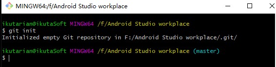
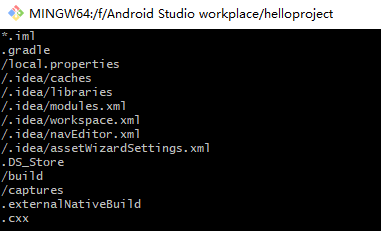

# 创建Android工程并上传至GitHub

## 创建工程目录并创建本地仓库

##### **git init**

建立一个本地仓库

##### 创建.gitigonore文件忽略部分文件

vim .gitignore

##### 上传工程代码

 git add . 

接下来的操作同https://github.com/Schean17/Cloudcomputing/blob/master/Basis/README.md/相同