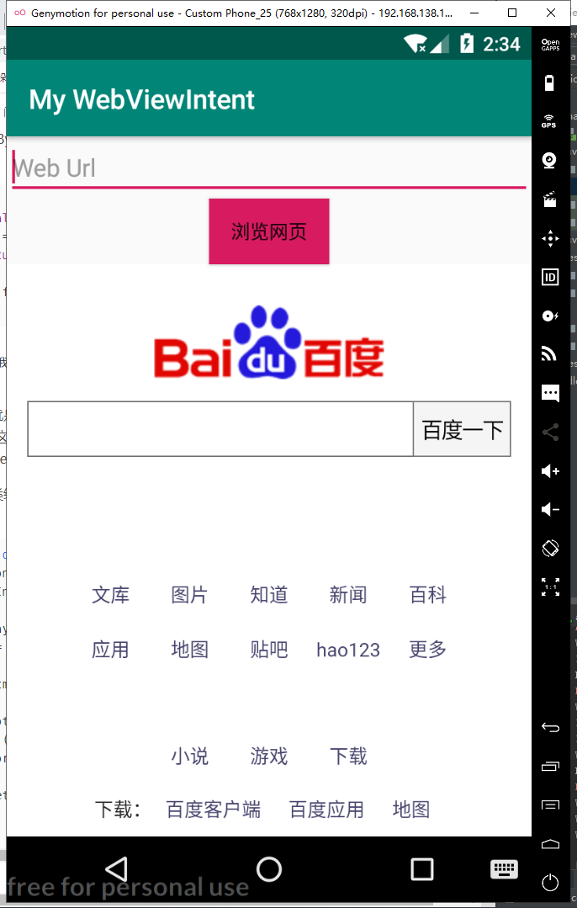

# Intent


# 新建一个工程用来获取URL地址并启动Intent  

### 隐式调用Intent打开浏览器

```java
package edu.fjnu.myintent;

import androidx.appcompat.app.AppCompatActivity;

import android.content.Intent;
import android.net.Uri;
import android.os.Bundle;
import android.view.View;
import android.widget.Button;
import android.widget.EditText;
import android.widget.TextView;

import org.w3c.dom.Text;

public class MainActivity extends AppCompatActivity {
    EditText editText1;
    Button bn;
    @Override
    protected void onCreate(Bundle savedInstanceState) {
        super.onCreate(savedInstanceState);
        setContentView(R.layout.activity_main);
        bn =(Button) findViewById(R.id.button);
        editText1  =(EditText)findViewById(R.id.urlinput);
        bn.setOnClickListener(new View.OnClickListener() {
            @Override
            public void onClick(View v) {
                Intent intent = new Intent();
                String uri="";

                uri=editText1.getText().toString();
                intent.setData(Uri.parse(uri));
                intent.setAction(Intent.ACTION_VIEW);
                startActivity(intent);
            }
        });

    }


}
```


# 新建一个工程使用WebView来加载URL  


```java
package edu.fjnu.mywebviewintent;

import androidx.appcompat.app.AppCompatActivity;

import android.content.Intent;
import android.net.Uri;
import android.os.Bundle;
import android.view.View;
import android.webkit.WebView;
import android.webkit.WebViewClient;
import android.widget.Button;
import android.widget.EditText;

import java.net.URL;

public class MainActivity extends AppCompatActivity {
    EditText editText;
    Button bn;
    @Override
    protected  void onCreate(Bundle savedInstanceState){
        super.onCreate(savedInstanceState);
        setContentView(R.layout.activity_main);
        bn=findViewById(R.id.button);
        editText  =(EditText)findViewById(R.id.urlinput);
        bn.setOnClickListener(new View.OnClickListener() {
            @Override
            public void onClick(View v) {
                Intent intent = new Intent();
                String uri="";
                uri=editText.getText().toString();
                intent.setData(Uri.parse(uri));
                intent.setAction(Intent.ACTION_VIEW);
                startActivity(intent);
            }
        });

        Intent intent=getIntent();
        Uri data = intent.getData();
        URL url=null;
        try{
            url=new URL(data.getScheme(),data.getHost(),data.getPath());
            startBroswer(url);
        }
        catch (Exception e){
            e.printStackTrace();
        }

    }
    private void startBroswer(URL url){
        WebView web=findViewById(R.id.web);
        web.loadUrl(url.toString());
        web.setWebViewClient(new WebViewClient(){
            @Override
            public boolean shouldOverrideUrlLoading(WebView v,String url){
                v.loadUrl(url);
                return true;
            }
        });
    }
}
```

**在调用startBroswer方法时要放入try语句块中，否则会因为错误初始化无法获取intent对象而闪退**


```java
<?xml version="1.0" encoding="utf-8"?>
<LinearLayout xmlns:android="http://schemas.android.com/apk/res/android"
    android:orientation="vertical"
    android:layout_width="match_parent"
    android:layout_height="match_parent"
    android:gravity="center_horizontal">
    <EditText
        android:layout_width="match_parent"
        android:layout_height="wrap_content"
        android:id="@+id/urlinput"
        android:hint="Web Url" />

    <Button
        android:id="@+id/button"
        android:layout_width="wrap_content"
        android:layout_height="wrap_content"
        android:text="浏览网页"
        android:background="@color/colorAccent"
        android:layout_gravity="center"
        android:gravity="center" />
    <WebView
        android:layout_width="wrap_content"
        android:id="@+id/web"
        android:layout_height="wrap_content">
    </WebView>

</LinearLayout>
```


```
AndroidManifest.xml
<?xml version="1.0" encoding="utf-8"?>
<manifest xmlns:android="http://schemas.android.com/apk/res/android"
    package="edu.fjnu.mywebviewintent">
    <uses-permission android:name="android.permission.INTERNET"/>
    <application
        android:allowBackup="true"
        android:icon="@mipmap/ic_launcher"
        android:label="@string/app_name"
        android:roundIcon="@mipmap/ic_launcher_round"
        android:supportsRtl="true"
        android:theme="@style/AppTheme">
        <activity android:name="edu.fjnu.mywebviewintent.MainActivity">
            <intent-filter>
                <action android:name="android.intent.action.MAIN" />

                <category android:name="android.intent.category.LAUNCHER" />
            </intent-filter>
            <intent-filter>
                <action android:name="android.intent.action.VIEW"/>
                <category android:name="android.intent.category.DEFAULT"/>
                <category android:name="android.intent.category.BROWSABLE"/>
                <data android:scheme="http"/>
            </intent-filter>
        </activity>
    </application>


</manifest>
```

**AndroidManifest中报错的处理办法**

在intent-filter中，设置action为android.intent.action.VIEW，且category为android.intent.category.DEFAULT时会报错Imbrowsable，加上 android.intent.category.BROWSABLE"可解


