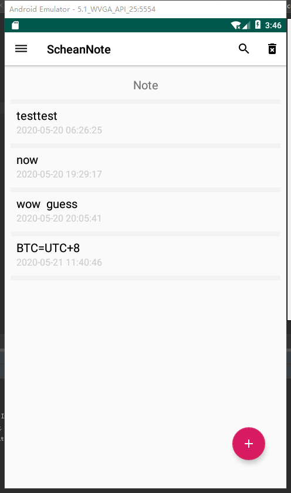
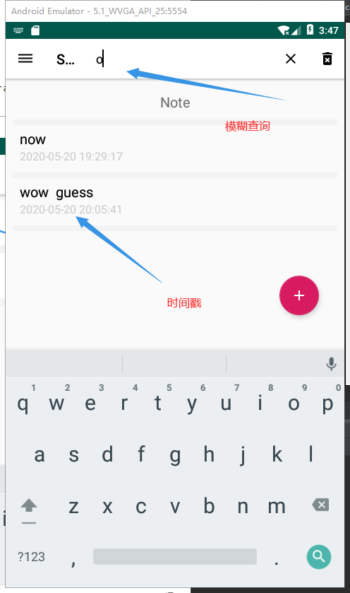
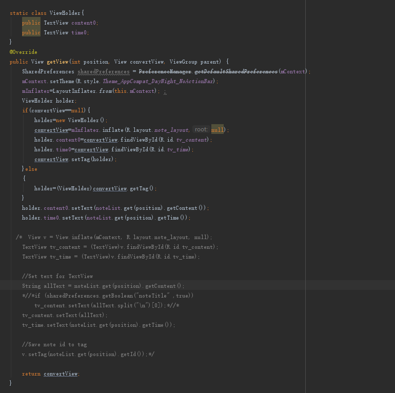

# NotePad实现


## 大致流程图




## 实现功能





### 1.查询功能

借用SearchView，重写onQueryTextSubmit、onQueryTextChange方法，并设置自定义filter

点击search按钮时拦截器进行拦截，将newText与数据库中的内容进行比较，有则显提示发生变化，刷新达到显示


> 接收提醒，刷新数据

```java
@Override
public Filter getFilter() {
    if (mFilter ==null){
        mFilter = new MyFilter();
    }
    return mFilter;
}

class MyFilter extends Filter {
    //我们在performFiltering(CharSequence charSequence)这个方法中定义过滤规则
    @Override
    protected FilterResults performFiltering(CharSequence charSequence) {
        FilterResults result = new FilterResults();
        List<Note> list;
        if (TextUtils.isEmpty(charSequence)) {//当过滤的关键字为空的时候，我们则显示所有的数据
            list = backList;
        } else {//否则把符合条件的数据对象添加到集合中
            list = new ArrayList<>();
            for (Note note : backList) {
                if (note.getContent().contains(charSequence)) {
                    list.add(note);
                }

            }
        }
        result.values = list; //将得到的集合保存到FilterResults的value变量中
        result.count = list.size();//将集合的大小保存到FilterResults的count变量中

        return result;
    }
    //在publishResults方法中告诉适配器更新界面
    @Override
    protected void publishResults(CharSequence charSequence, FilterResults filterResults) {
        noteList = (List<Note>)filterResults.values;
        if (filterResults.count>0){
            notifyDataSetChanged();//通知数据发生了改变
        }else {
            notifyDataSetInvalidated();//通知数据失效
        }
    }
}
```

### 2.实现时间戳功能


 

```java
 public boolean onKeyDown(int keyCode, KeyEvent event){
        if (keyCode == KeyEvent.KEYCODE_HOME){
            return true;
        }
        else if (keyCode == KeyEvent.KEYCODE_BACK){
            autoSetMessage();
            setResult(RESULT_OK, intent);
            finish();
            return true;
        }
        return super.onKeyDown(keyCode, event);
    }

    public void autoSetMessage(){
        if(openMode == 4){
            if(et.getText().toString().length() == 0){
                intent.putExtra("mode", -1); //nothing new happens.
            }
            else{
                intent.putExtra("mode", 0); // new one note;
                intent.putExtra("content", et.getText().toString());
                intent.putExtra("time", dateToStr());
                intent.putExtra("tag", tag);
            }
        }
        else {
            if (et.getText().toString().equals(old_content) && !tagChange)
                intent.putExtra("mode", -1); // edit nothing
            else {
                intent.putExtra("mode", 1); //edit the content
                intent.putExtra("content", et.getText().toString());
                intent.putExtra("time", dateToStr());、
                //调用dataToStr刷新时间并加入数据
                intent.putExtra("id", id);
                intent.putExtra("tag", tag);
            }
        }
    }

    public String dateToStr(){
        Date date = new Date();
        SimpleDateFormat simpleDateFormat = new SimpleDateFormat("yyyy-MM-dd HH:mm:ss");
        simpleDateFormat.setTimeZone(TimeZone.getTimeZone("GMT+8:00"));
        //设置强制北京时区，模拟机默认格林尼治时间
        return simpleDateFormat.format(date);
    }

```

### 3.contentprovider的getView优化



创建静态类ViewHolder存放View，将View缓存至ViewHolder，减少findViewById的调用次数

### 4.欢迎页

使用Handler设置

```java
package com.example.ScheanNote;
import android.app.Activity;
import android.content.Intent;
import android.os.Bundle;
import android.os.Handler;
import android.os.Message;
import android.view.Window;
import android.view.WindowManager;


import androidx.annotation.Nullable;

import com.example.biji.R;

public class FirstActivity  extends Activity {
    @Override
    protected void onCreate(@Nullable Bundle savedInstanceState) {
        super.onCreate(savedInstanceState);
        //隐藏标题栏以及状态栏
        getWindow().setFlags(WindowManager.LayoutParams.FLAG_FULLSCREEN,
                WindowManager.LayoutParams.FLAG_FULLSCREEN);
        /**标题是属于View的，所以窗口所有的修饰部分被隐藏后标题依然有效,需要去掉标题**/
        requestWindowFeature(Window.FEATURE_NO_TITLE);
        setContentView(R.layout.first_layout);
        handler.sendEmptyMessageDelayed(0,3000);
    }

    private Handler handler = new Handler() {
        @Override
        public void handleMessage(Message msg) {
            getHome();
            super.handleMessage(msg);
        }
    };

    public void getHome(){
        Intent intent = new Intent(FirstActivity.this, MainActivity.class);
        startActivity(intent);
        finish();
    }


}
```


```xml
<?xml version="1.0" encoding="utf-8"?>
<LinearLayout xmlns:android="http://schemas.android.com/apk/res/android"
    android:orientation="vertical" android:layout_width="match_parent"
    android:layout_height="match_parent">

    <ImageView
        android:layout_width="match_parent"
        android:layout_height="match_parent"
        android:id="@+id/imageView"
        android:layout_gravity="center_horizontal"
        android:src="@drawable/first_image"
        >

    </ImageView>
</LinearLayout>
```


