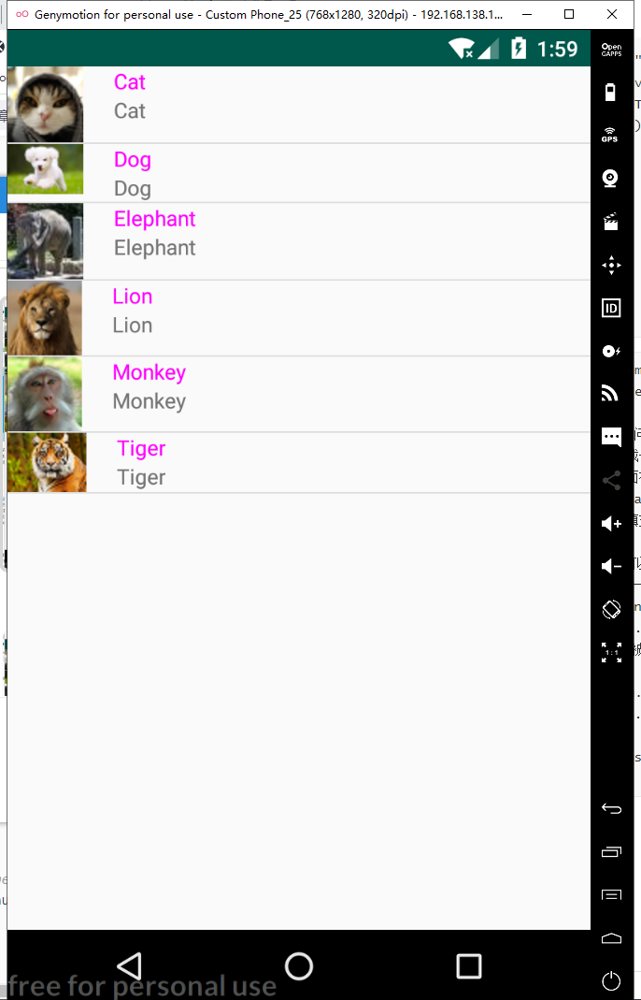
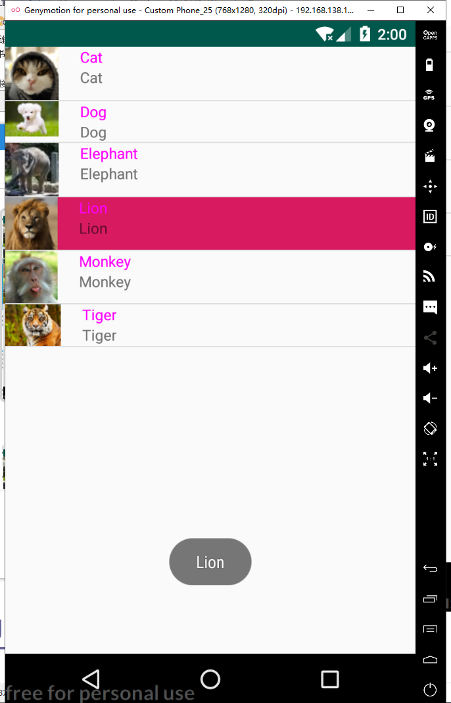
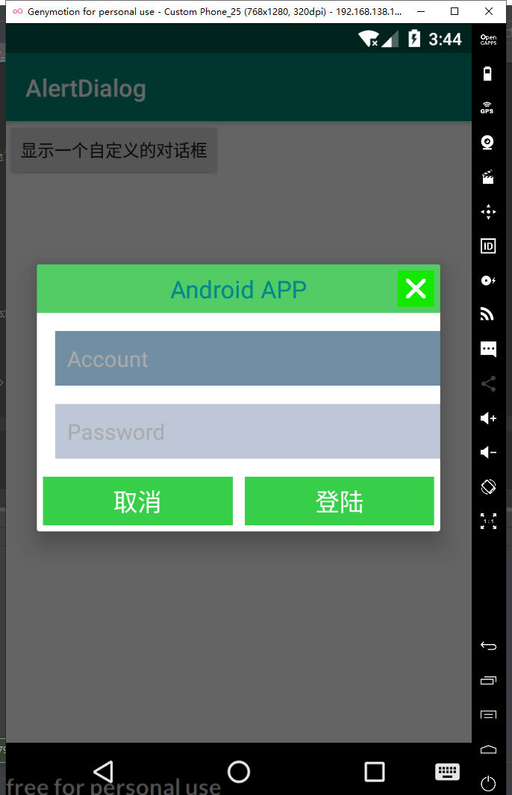
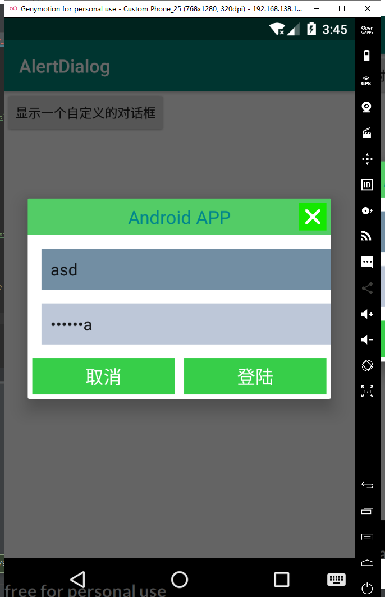
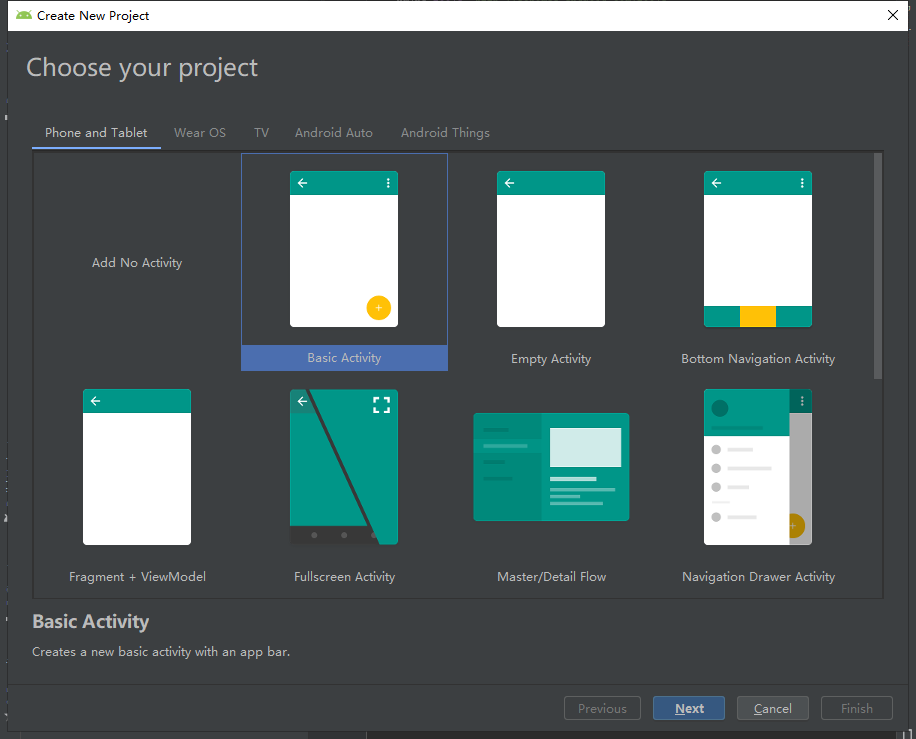
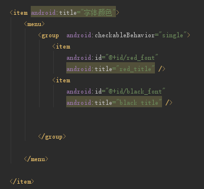
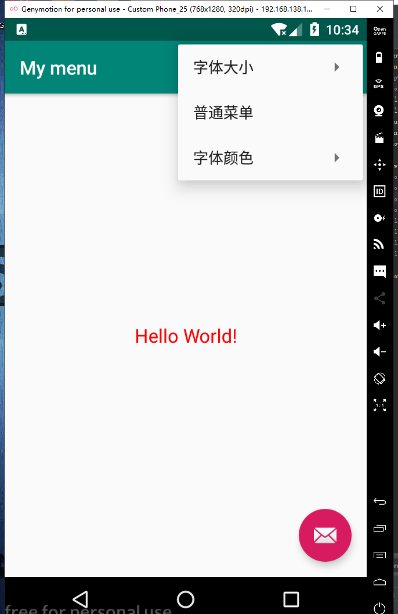
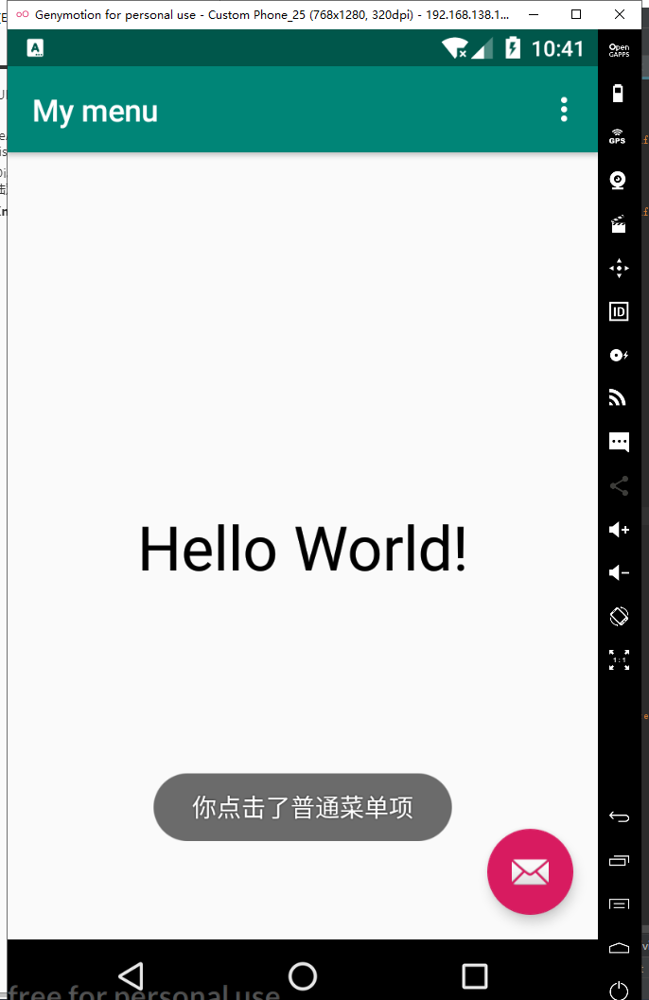
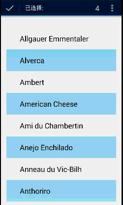

# 实验三 UI

## 利用SimpleAdapter实现ListView


```
MainActivity.java
package edu.fjnu.simplelistview;

import android.app.Activity;
import android.content.Context;
import android.os.Bundle;
import android.util.Log;
import android.view.View;
import android.widget.AdapterView;
import android.widget.ArrayAdapter;
import android.widget.ListView;
import android.widget.SimpleAdapter;
import android.widget.TextView;
import android.widget.Toast;

import java.util.ArrayList;
import java.util.HashMap;
import java.util.List;
import java.util.Map;


public class MainActivity extends Activity {
    private String [] name ={"Cat","Dog","Elephant","Lion","Monkey","Tiger"};
    private String [] desc= {"Cat","Dog","Elephant","Lion","Monkey","Tiger"};
    private int[] imageID={R.drawable.cat,R.drawable.dog,R.drawable.elephant,R.drawable.lion,R.drawable.monkey,R.drawable.tiger};
    private ListView list_view;
    String tag="MyActivity.class";
    private List<Animal> animalList=new ArrayList<Animal>();

    @Override
    protected void onCreate(Bundle savedInstanceState) {
        super.onCreate(savedInstanceState);
        setContentView(R.layout.activity_main);
       List<Map<String,Object>> listems=new ArrayList<Map<String,Object>>();
       for(int i=0;i<name.length;i++){
           Map<String,Object> listem=new HashMap<String,Object>();
           listem.put("head",imageID[i]);
           listem.put("name",name[i]);
           listem.put("desc",desc[i]);
           listems.add(listem);
       }
        SimpleAdapter simplead =new SimpleAdapter(this,listems,R.layout.animal,new String[]{"name","head","desc" },new int[]{R.id.name,R.id.head,R.id.desc});
       list_view= (ListView) findViewById(R.id.list_view);
       list_view.setAdapter(simplead);
       list_view.setSelector(R.color.colorAccent);
       list_view.setOnItemClickListener(new AdapterView.OnItemClickListener() {
           @Override
           public void onItemClick(AdapterView<?> parent, View view, int position, long id) {
               Log.d(tag,"点击了！");
               TextView tv_name= (TextView) view.findViewById(R.id.name);
               Toast.makeText(MainActivity.this, tv_name.getText(), Toast.LENGTH_SHORT).show();
           }
       });

    }


}
```

```
 SimpleAdapter(this,listems,R.layout.animal,new String[]{"name","head","desc" },new int[]{R.id.name,R.id.head,R.id.desc});
 /*SimpleAdapter的参数说明
		 * 第一个参数 表示访问整个android应用程序接口，基本上所有的组件都需要
		 * 第二个参数表示生成一个Map(String ,Object)列表选项
		 * 第三个参数表示界面布局的id  表示该文件作为列表项的组件
		 * 第四个参数表示该Map对象的哪些key对应value来生成列表项
		 * 第五个参数表示来填充的组件 Map对象key对应的资源一依次填充组件 顺序有对应关系
		 * 注意的是map对象可以key可以找不到 但组件的必须要有资源填充  因为 找不到key也会返回null 其实就相当于给了一个null资源
		 * 下面的程序中如果 new String[] { "name", "head", "desc","name" } new int[] {R.id.name,R.id.head,R.id.desc,R.id.head}
		 * 这个head的组件会被name资源覆盖
		 * */
原文链接：https://blog.csdn.net/x605940745/article/details/11981049
 View.setSelector(R.color.colorAccent);
 #设定点击时显示的颜色
 View.setsetOnItemClickListener 设定点击事件监听器
 
```







## AlertDialog实现登陆对话框


```
final EditText etUsername = v.findViewById(R.id.signaccont);
                final EditText etPassword = v.findViewById(R.id.signpasswd);
                Toast.makeText(getApplicationContext(),"登陆："+"账号： " + etUsername.getText().toString() + "  密码： " + etPassword.getText().toString(),Toast.LENGTH_SHORT).show();
                通过findViewById获取EditText，再用getText获取编辑框中的文本
```







## 使用Xml定义菜单

创建新项目，选择BasicActivity项目



在Menu的menu_main中创建菜单



<group>

###### <group.../>子元素：将多个<item.../>定义的菜单包装成一个菜单组。<group.../>子元素用于控制整组菜单的行为，该元素可以指定如下常用属性。

- checkableBehavior：指定该组菜单的选择行为。可指定为none（不可选）、all（多选）和single（单选）三个值。

- menuCategory：对菜单进行分类，指定菜单的优先级。有效值为container、system、secondary和alternative。

- visible：指定改组菜单是否可见。

- enable：指定该组菜单是否可用。

  ######   <item.../>元素用于指定一份菜单项，<item.../>元素又可包含<menu.../>元素，位于<item.../>元素内部的<menu.../>就代表子菜单。


在Activity中创建菜单分两步：

1. onCreateOptionsMenu 创建选项菜单；用Inlater获取Menu实例
2. onOptionsItemSelected 设置被选事件

```
@Override
public boolean onCreateOptionsMenu(Menu menu) {
    // Inflate the menu; this adds items to the action bar if it is present.
    MenuInflater inflator = new MenuInflater(this);
    inflator.inflate(R.menu.menu_main, menu);
    return true;
}

@Override
public boolean onOptionsItemSelected(MenuItem mi) {
    // Handle action bar item clicks here. The action bar will
    // automatically handle clicks on the Home/Up button, so long
    // as you specify a parent activity in AndroidManifest.xml.
    textView = findViewById(R.id.txt);
    if(mi.getItemId()==R.id.font_10){
        textView.setTextSize(10 * 2);
        return true;
    }
    if(mi.getItemId()==R.id.font_16)
    {
        textView.setTextSize(16 * 2);
        return true;
    }
    if(mi.getItemId()==R.id.font_20){
        textView.setTextSize(20*2);
        return true;
    }
    if(mi.getItemId()==R.id.red_font){
        textView.setTextColor(Color.RED);
        return true;
    }
    if(mi.getItemId()==R.id.black_font){
        textView.setTextColor(Color.BLACK);
        return true;
    }
    if(mi.getItemId()==R.id.normal_menu){
        Toast.makeText(MainActivity.this, "你点击了普通菜单项", Toast.LENGTH_SHORT).show();
        return true;
    }
```






## 创建上下文菜单

a）首先给View注册上下文菜单registerForContextMenu()

b）添加上下文菜单内容onCreateContextMenu()

——可以通过代码动态添加；

——也可以加载xml文件中的菜单项；

c）设置菜单点击后响应事件onContextMenuItemSelected()

如果您在 `ListView` 或 `GridView` 中有一组项目（或 `AbsListView` 的其他扩展），且希望允许用户执行批处理操作，则应：

- 实现 `AbsListView.MultiChoiceModeListener` 接口，并使用 `setMultiChoiceModeListener()` 为视图组设置该接口。在侦听器的回调方法中，您可以为上下文操作栏指定操作、响应操作项目的点击事件，以及处理从 `ActionMode.Callback` 接口继承的其他回调。
- 使用 `CHOICE_MODE_MULTIPLE_MODAL` 参数调用 `setChoiceMode()`。





```

        
```

